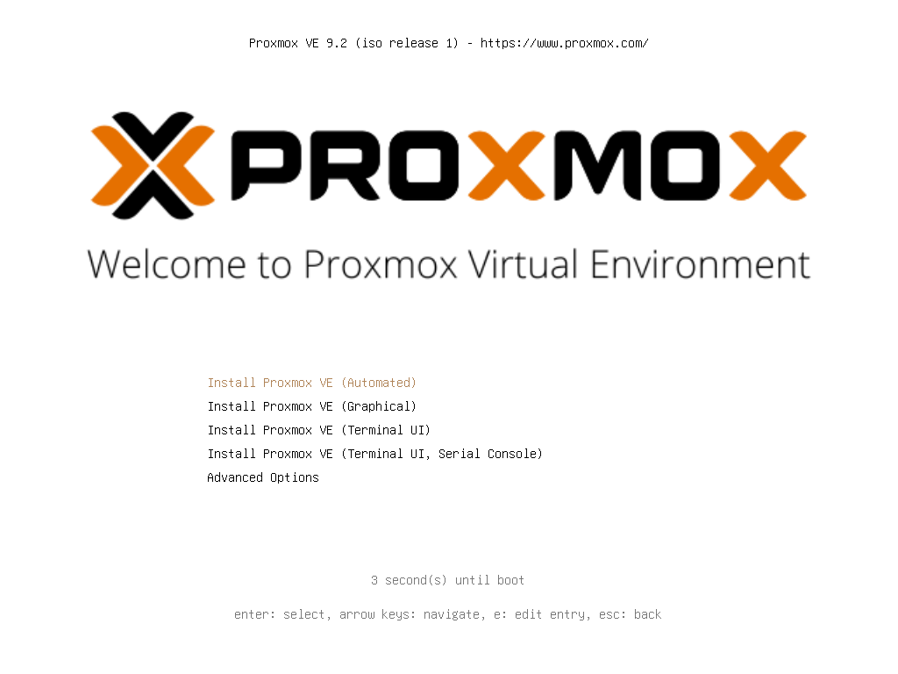
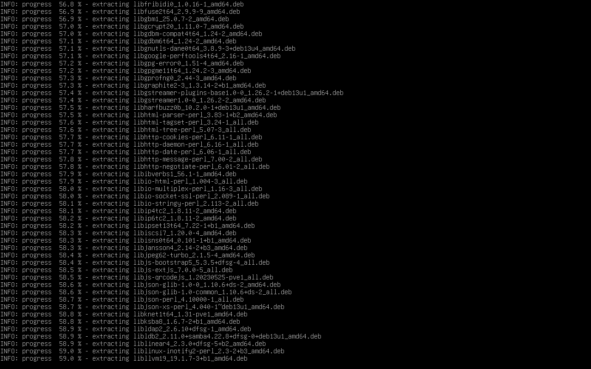

# Install Proxmox VE on a bare-metal server

Install Proxmox VE on a bare-metal server from its provider's rescue system, using QEMU/KVM to run the official installer against the two physical disks. Hetzner dedicated servers are the tested and recommended platform; any provider that meets the requirements below should work. People and AI agents follow the same scripts and checks.

[Infrastructure](../README.md) · [Episode index](../../episodes/README.md) · [Teaching materials](materials/README.md)

| Detail | Value |
|---|---|
| Status | Available for the tested configuration |
| Video | Recording |
| Last live test | 2026-09-07 on a Hetzner AX41, see [tested configuration](tested-configuration.md) |
| Materials | None yet |

The scripts changed after that live test. The tested configuration lists which changes have not been rerun on a server.

## What this guide does

You end up with Proxmox VE 9 on a two-NVMe ZFS mirror, a static IPv4 address pinned to the physical NIC, IPv6 disabled, key-only SSH, the web GUI on localhost only, the cluster services turned off, and all updates applied. Guests, a reverse proxy, and Pangolin are separate guides.

Everything the guide configures comes from the scripts in this directory. You do not need a third-party post-install script on top; [verification and first boot](verification.md) covers the repository switch, updates, and the single-node cleanup.

The tested hardware is a Hetzner AX41, an AMD server with two NVMe drives and a gateway inside the IPv4 subnet. Another provider's server, other storage layouts, Intel microcode, and routed `/32` networks need their own validation. The directory is named after the tested provider; the procedure is not tied to it.

### Server and provider requirements

- Bare metal only. The installer runs the Proxmox ISO inside KVM on the rescue system, so the rescue system needs `/dev/kvm`. A virtual server has no usable KVM, and Proxmox inside a VPS is not what this guide builds.
- A rescue or live system you can boot from the provider panel with your SSH public key. It must be Debian 12 or 13 based with root over SSH and `apt` access to the internet, because the builder installs QEMU and debootstrap there. The guide calls it Rescue whatever the provider names it.
- Legacy BIOS boot. Either the server boots in BIOS mode already or the provider lets you set that through a console or support.
- Two disks of the same size for the ZFS mirror. NVMe is tested. QEMU presents both disks as NVMe whatever the physical bus, so the answer file's device names stay the same.
- Enough RAM and CPU in Rescue for the guest. The launchers give it 8 GB and 8 threads; lower `-m` and `-smp` in both launchers if the server has less.
- A static public IPv4 address with a gateway inside its subnet, and a provider panel that shows the address, prefix, gateway, and the NIC's MAC so you can check what Rescue reports.
- Console access, such as KVM over IP or IPMI, for the case where the physical boot fails.

**Legacy BIOS is mandatory** for Rescue, the temporary QEMU guest, and the physical server. An earlier attempt installed with UEFI firmware in QEMU on a server that boots in BIOS, and that mismatch is why every launcher now refuses anything except `FIRMWARE_MODE=bios`. They also stop if Rescue itself booted in UEFI. Starting QEMU cannot change the physical firmware; if the server is in UEFI mode, arrange a legacy BIOS boot through the provider console or support first.

**The installation erases both selected disks.** Read the serials from the target server and confirm that all their data can be lost. A mirror is redundancy, not a backup.

If an agent does the installation, point it at the [installation skill](../../skills/install-proxmox-hetzner/SKILL.md). It collects the server details and checks the boot mode. Rules for agents are in the [topic rules](AGENTS.md).

Workstation commands assume this guide's directory is current. From the repository root:

```text
cd infrastructure/proxmox-hetzner
```

On a Windows workstation, run multiline Bash blocks in Git Bash, or enter the individual commands in your shell's syntax. Blocks labeled Rescue, installed guest, or Proxmox run in Bash on that machine.

## 1. Activate Rescue and connect

In your provider's panel, activate the rescue system with your SSH public key and reboot into it. On Hetzner, that is Linux Rescue in Robot. Keep the panel open in case you need another Rescue boot or a console.

On your workstation, replace `SERVER_IP` with the actual address:

```bash
ssh root@SERVER_IP
```

If you use Bitwarden's SSH agent, unlock it and approve access to the intended key. Do not export the private key or send it to the server.

The server host key changes between Debian, Rescue, and Proxmox. Verify a changed fingerprint through a trusted path before replacing a saved entry. After verification, remove only this server's old entry with `ssh-keygen -R SERVER_IP`. Do not disable host-key checking globally.

## 2. Collect the server values

From this guide's directory on your workstation:

```bash
scp preflight.sh root@SERVER_IP:/root/preflight.sh
ssh root@SERVER_IP 'bash /root/preflight.sh'
```

The output must show `BOOT_MODE=BIOS`. If it shows UEFI, stop here and arrange a legacy BIOS boot.

In Rescue, read the health of each intended drive. Replace the device paths with the ones preflight listed:

```bash
smartctl -H -A /dev/nvme0n1
smartctl -H -A /dev/nvme1n1
```

Record these values before continuing. Preflight prints most of them; the commands are listed so you can rerun one in Rescue:

| Value | Where to get it |
|---|---|
| Disk paths and serials | `lsblk -d -o PATH,SIZE,MODEL,SERIAL`, then the matching `/dev/disk/by-id/` link |
| IPv4 and prefix | `ip -4 -br addr`, checked against the provider panel |
| IPv4 gateway | `ip -4 route`, checked against the provider panel |
| Physical MAC | `ip -br link` |
| DNS resolvers | `resolvectl dns` |
| Rescue boot mode | `BOOT_MODE` in the preflight output; must be BIOS |
| Desired FQDN, email, timezone | Your choices |

Check mounts, swap, `/proc/mdstat`, and disk holders. A previous Debian installation may have active software RAID even when nothing is mounted. Inspect the affected arrays and stop only those, after approving their destruction. The installer refuses disks with active holders.

Some rescue systems, including Hetzner's, ship a `zpool` wrapper that installs ZFS on first use. Do not run `zpool` as an inventory command unless ZFS is already loaded. If `/sys/module/zfs` exists, inspect `zpool status -LP`. Review any affected pool before exporting it, and keep it exported while QEMU uses its disks.

## 3. Copy the scripts

Create the working directory in Rescue:

```bash
install -d -m 0700 /tmp/proxmox-auto
```

From this guide's directory on your workstation:

```bash
scp build-installer.sh install-qemu.sh check-disks.sh boot-installed-qemu.sh first-boot-disable-ipv6.sh set-answer-credentials.py qemu-screen.py answer.toml.example install.env.example root@SERVER_IP:/tmp/proxmox-auto/
```

The update and single-node scripts for the finished host are copied later, in the verification guide, because files left in Rescue do not survive the reboot.

Back in Rescue:

```bash
(
set -eu
cd /tmp/proxmox-auto
sed -i 's/\r$//' ./*.sh ./*.py ./*.example
chmod 0700 ./*.sh
for script in ./*.sh; do bash -n "$script"; done
cp answer.toml.example answer.toml
cp install.env.example install.env
chmod 0600 answer.toml install.env
)
```

Fix any syntax error before proceeding. The line-ending conversion covers every copied file, so an `install.env` edited on Windows does not fail the BIOS check with a stray carriage return.

## 4. Fill in the answer and disk settings

Edit both files in Rescue. The example's `192.0.2.10` and `example.com` are documentation values; the builder refuses an answer that still contains them.

```bash
cd /tmp/proxmox-auto
vi answer.toml
vi install.env
```

In `answer.toml`, replace the FQDN, contact email, country, timezone, IPv4/prefix, gateway, DNS, and both MAC placeholders. Write the MAC in lowercase. For the physical MAC `02:00:00:00:00:10`, the filter becomes `*020000000010` and the mapping line becomes `"02:00:00:00:00:10" = "nic0"`. The same MAC goes into `install.env` as `NIC_MAC`; the builder checks that all three agree.

In `install.env`, set the stable `/dev/disk/by-id/` paths and live serials of both physical disks, and set `GUEST_CIDR` and `GUEST_GATEWAY` to the same values as the answer. Keep `FIRMWARE_MODE=bios`. The answer's `nvme0n1` and `nvme1n1` name the two NVMe controllers inside QEMU, in the order `install.env` lists the disks; they are not copied from the physical device order.

Use only the SSH public keys you want on the installed host. If the Rescue authorized-keys file contains exactly those plain public-key lines, run in Rescue:

```bash
cd /tmp/proxmox-auto
python3 set-answer-credentials.py answer.toml /root/.ssh/authorized_keys
```

The helper validates each key with `ssh-keygen`, prompts twice for a root password of at least 16 characters without echoing it, hashes it with SHA-512 crypt, and inserts the keys. Store the password in your password manager. The generated answer and ISO both contain the hash and must stay private.

Agents can pass `--random-password` to hash and discard a random password, then set a usable one over verified SSH later. The verification guide covers that handoff.

The builder always includes the first-boot hook that disables IPv6 through sysctl and adds `ipv6.disable=1` to the kernel command line. If you need IPv6, stop here; that configuration has not been validated. Kernel-level IPv6 disablement can affect Proxmox firewall backends. Firewall deployment is outside this guide.

## 5. Download and verify the ISO

In Rescue:

```bash
cd /tmp/proxmox-auto
curl -fL --retry 4 --retry-all-errors \
  -o proxmox-ve_9.2-1.iso \
  https://enterprise.proxmox.com/iso/proxmox-ve_9.2-1.iso
echo '4e88fe416df9b527624a175f24c9aa07c714d3332afb1ee3dbf3879573ef2c6c  proxmox-ve_9.2-1.iso' | sha256sum -c -
```

Expected result: `proxmox-ve_9.2-1.iso: OK`. Check the filename and checksum against the [official download page](https://enterprise.proxmox.com/iso/). If you change versions, update and revalidate the builder, answer schema, and boot workflow together.

## 6. Build the unattended installer

Run in Rescue:

```bash
systemd-run --unit=pve-build-installer --property=Type=exec --property=RemainAfterExit=yes \
  /bin/bash -c 'umask 077; exec /tmp/proxmox-auto/build-installer.sh > /tmp/proxmox-auto/build.log 2>&1'
```

The builder installs the QEMU/KVM prerequisites in Rescue and builds a separate Debian 13 chroot for the Proxmox installation assistant. It verifies the repository signing-key fingerprint, checks the MAC entries against `install.env`, and validates the answer. Its package repository is the [official signed HTTP repository](https://github.com/proxmox/pve-docs/blob/master/pve-package-repos.adoc); ISO and signing-key downloads use HTTPS.

Monitor it in Rescue:

```bash
systemctl show pve-build-installer -p ActiveState -p SubState -p ExecMainStatus
tail -20 /tmp/proxmox-auto/build.log
```

While it runs, `SubState=running`. Continue only when it reports `SubState=exited` with `ExecMainStatus=0`, the log says `Answer validation passed`, and `/tmp/proxmox-auto/proxmox-auto.iso` exists. The unit keeps that result on purpose; a unit that never ran would show `SubState=dead` instead. Treat the logs as private; failed validation can include credential fields. Do not publish the modified ISO.

If the build fails, the unit shows `SubState=failed`. Read the error, fix the cause, then run `systemctl reset-failed pve-build-installer` before starting the build again. A build retry does not erase disks.

## 7. Approve and install

Replace `SERIAL_1` and `SERIAL_2` with the two approved serials, in the order `install.env` lists them. The launcher refuses any other value, so a leftover `YES` from an older run cannot approve different disks. In Rescue, load your reviewed environment and run the preflight:

```bash
(
set -eu
set -a
. /tmp/proxmox-auto/install.env
set +a
ERASE_CONFIRMED=SERIAL_1+SERIAL_2 CHECK_ONLY=1 /tmp/proxmox-auto/install-qemu.sh
)
```

The preflight must print both expected serials and `Preflight passed; QEMU was not started`. Type the serials only after you have approved exactly those disks. An agent must get that approval from the owner; the flag is not a substitute for it.

Start the destructive installation in Rescue, again with the real serials:

```bash
systemd-run --unit=pve-install-qemu --property=Type=exec --property=RemainAfterExit=yes \
  /bin/bash -c 'set -eu; set -a; . /tmp/proxmox-auto/install.env; set +a; export ERASE_CONFIRMED=SERIAL_1+SERIAL_2; umask 077; exec /tmp/proxmox-auto/install-qemu.sh > /tmp/proxmox-auto/install.log 2>&1'
```

The prepared ISO selects the automated installer and powers QEMU off when installation succeeds.



In Rescue, monitor the unit and capture the QEMU screen when needed:

```bash
systemctl show pve-install-qemu -p ActiveState -p SubState -p ExecMainStatus
python3 /tmp/proxmox-auto/qemu-screen.py
```

Some installer progress appears only on the graphical console. The helper writes `/tmp/proxmox-auto/qemu-screen.ppm` through a private Unix socket; no VNC port is opened. Fetch it from your workstation and open it with any viewer that reads PPM, such as GIMP or IrfanView:

```bash
scp root@SERVER_IP:/tmp/proxmox-auto/qemu-screen.ppm .
```



Do not restart the installer because SSH disconnected or the screen stopped changing. Inspect the existing unit first. Repeating this step erases the disks again.

## 8. Verify the installed system

Follow [verification and first boot](verification.md) before rebooting the physical server. It covers both BIOS boot partitions, a temporary boot of the installed disks in QEMU, trusted SSH host-key capture, the physical reboot, updates, and final checks.

If the installed system works in QEMU but the physical server does not boot, use [inspect a failed boot](boot-recovery.md).

## Agent instructions

Agents read the [root rules](../../AGENTS.md), the [topic rules](AGENTS.md), and the [installation skill](../../skills/install-proxmox-hetzner/SKILL.md). The skill follows this guide's scripts and checkpoints; it is not a second procedure. See [using an AI agent](../../USING-AI.md) for a starting prompt.

Local maintenance checks for this guide are listed in [CONTRIBUTING.md](../../CONTRIBUTING.md#check-the-current-proxmox-guide). The live refusal test, [preflight-refusals.sh](tests/preflight-refusals.sh), runs in Rescue after the ISO is built: copy it into `tests/` beneath the work directory, load the reviewed `install.env` with `set -a`, and run it with Bash. It checks a missing, legacy `YES`, or mismatched erase flag, missing or invalid firmware modes, UEFI, duplicate disks, and a wrong serial. Every invocation forces `CHECK_ONLY=1`; it never launches QEMU.

## References

- [Proxmox ISO downloads and checksums](https://enterprise.proxmox.com/iso/)
- [Proxmox automated installation](https://pve.proxmox.com/wiki/Automated_Installation)
- [Proxmox bootloader documentation](https://pve.proxmox.com/wiki/Host_Bootloader)
- [Proxmox package repository source documentation](https://github.com/proxmox/pve-docs/blob/master/pve-package-repos.adoc)
- [Hetzner unattended Proxmox tutorial](https://community.hetzner.com/tutorials/install-proxmox-unattended-hetzner/), the provider-specific starting point for this workflow
